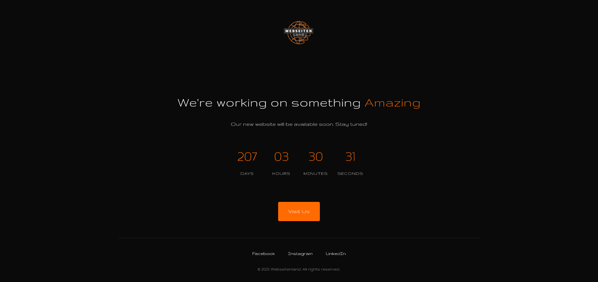

# Coming Soon Page project by Webseitenland

**This project was created by [webseitenland.de](https://webseitenland.de/).**

**Project start date:** June 5, 2025

The contents of this project are protected by copyright. For more information, please refer to the `LICENSE` file.

> A professionally designed "Coming Soon" page with modern design, countdown functionality, and full accessibility support.



## Features

- Responsive design for all device sizes
- Interactive countdown to launch date
- Accessibility optimized (ARIA support, keyboard navigation, screen reader announcements)
- Performance optimized (preloading, resource hints)
- SEO ready (meta tags, structured data, sitemap)
- Browser compatibility (cross-browser support with fallbacks)
- Mobile-friendly

## File Structure

```
├── index.html              # Main HTML file
├── style.css               # Stylesheet
├── .htaccess               # Apache server configuration
├── robots.txt              # Crawler instructions
├── sitemap.xml             # XML sitemap
├── site.webmanifest        # Web app manifest
├── images/                 # Directory for images
│   ├── page.png            # Sample Image
│   ├── logo.png            # Webseitenland logo
│   └── icons/              # Directory for icons
│       ├── favicon.ico             # Favicon (main)
│       ├── favicon-32x32.png       # Favicon (32px)
│       ├── favicon-16x16.png       # Favicon (16px)
│       ├── apple-touch-icon.png    # Apple touch icon
│       ├── android-chrome-512x512.png  # Android icon (large)
│       ├── android-chrome-192x192.png  # Android icon (small)
│       └── logo.svg                # SVG logo
```

## Configuration

The countdown can be configured in the JavaScript section of `index.html`:

```javascript
const config = {
    // Set to 'false' if the date is unknown
    isDateKnown: true,
    
    // Specify launch date in YYYY-MM-DD format
    launchDate: "2025-12-31",
    
    // Alternative: Number of days in the future
    daysFromNow: 30,
    
    // Text to display when date is unknown
    unknownDateText: "Coming Soon"
};
```

## Browser Support

- Chrome (latest)
- Firefox (latest)
- Safari (latest)
- Edge (latest)
- Opera (latest)
- Mobile browsers

## Accessibility

The page is fully accessible with:
- Semantic HTML5 markup
- ARIA attributes
- Keyboard navigation
- Screen reader announcements
- Skip-to-content link
- Focus management
- Reduced motion support

## SEO

Includes:
- Open Graph meta tags
- Twitter Card meta tags
- JSON-LD structured data
- Canonical URLs
- XML sitemap

## Installation

1. Upload all files to your web server
2. Configure your domain to point to the directory
3. Update the countdown configuration in `index.html` if needed
4. Customize colors in `style.css` if desired

---

Created by Webseitenland | [Visit our website](https://webseitenland.de) 